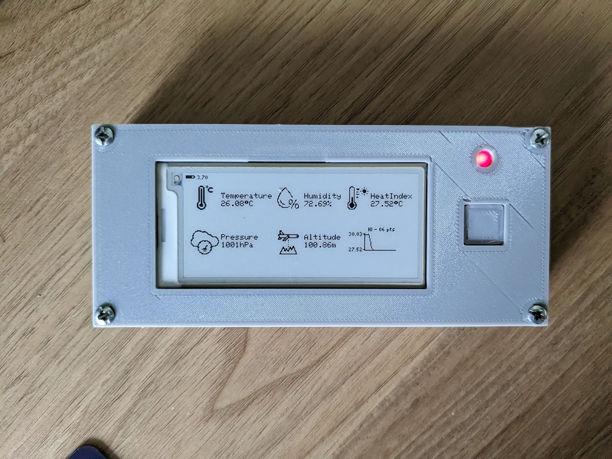
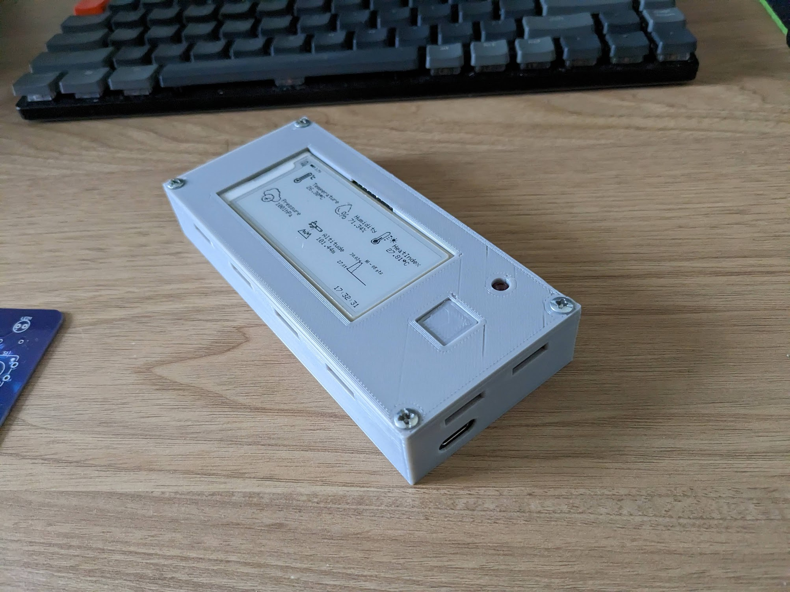

# Esp32 EinkWeatherMonitor
This E-Ink Weather Monitor uses a BME280 sensor to read temperature and humidity data every 10minutes. This is displayed on an Eink Screen and stored in a self-hosted webserver using the HTTP Protocol. 

# Contents
## Firmware
Explanation and code for the ESP32, connected to the Eink screen and BME280
- [ESP32](#esp32)
- [Eink Screen](#eink-screen)

## Hardware
 - [STL Files](./casing/) with [Case Comments](#case-comments)
 - [PCB Files](./pcb/) (Manufactured by JLCPCB)
 - [Energy](#energy)

## Software
Instructions to set up bluehost to recieve weather data from the ESP32 and publish to an online graph. These were mainly adapted from this [source](https://randomnerdtutorials.com/visualize-esp32-esp8266-sensor-readings-from-anywhere/).
- [Network Architecture](#network-architecture)
- [SQL Database](#sql-database)
- [PHP Scripts](#php-scripts)

# Firmware
## ESP32
An [Adafruit ESP32 Huzzah v2](https://www.adafruit.com/product/5400) was used because it could fit in the breadboard better and had Lipo charging capabilities. Hence, this could be used a more portable project.

The ESP32 code is simple. The BME280 sensor is wired to the ESP32 and the sensor data is posted in the format. Note that `serverName` is the post data website, for instance: https://example/post-data.php.

    WiFiClient client;
    HTTPClient http;
    http.begin(client, serverName);
    http.addHeader("Content-Type", "application/x-www-form-urlencoded");
    String httpRequestData = "api_key=" + apiKeyValue + "&value1=" + String(bme.readTemperature())
                           + "&value2=" + String(bme.readHumidity()) + "&value3=" + String(bme.readPressure()/100.0F) + "";
    Serial.print("httpRequestData: ");
    Serial.println(httpRequestData);
    
    int httpResponseCode = http.POST(httpRequestData);

I added the deep sleep functionality for it to get data every **10mins**. Hence the trend of data is better seen. With a maximum of 40 data points, we can see how the data changes over around 6 hours.

For the time function, I used the internal RTC memory and the NTP Client server to get the time which is printed on the Eink screen. There will be times that the post function does not work, or WiFi is not connected, and I still want to see the last reading. The NTP Client Server is initially used to get the time and is saved to RTC memory. If wifi is not connected, then the RTC memory is incremented by 10mins and that is displayed. 

Note that the RTC memory will be initialised on boot up to the assigned value. After that it uses past stored RTC values.

The Secrets.h file was used to protect personal data. To use my code, create a header file called `Secrets.h` and fill in the following detais.

    //Private info, in Gitignore

    const char* WIFI_SSID = "WIFI";
    const char* WIFI_PASSWORD = "WIFI_PASS";

    const char* OTA_SSID = "OTA_WIFI";
    const char* OTA_PASSWORD = "OTA_PASS";

    const char* BLUEHOST_POST = "BLUEHOST_POST";

    String ESP32_API_KEY = "PERSONAL_ESP32_API";

The USB port is only for charging the Huzzah. There is no data cable due to mistakes in the PCB. Hence, the push button is designed to push the ESP32 into OTA mode.

1) Push button will wake the ESP32 and connect to the OTA WiFI
2) From there, the IP address is printed on the Eink screen. Connect to IP_address/update over the OTA wifi to upload code over OTA.

## Eink Screen
I added an Eink screen to display the latest data. The [GxEPD2 Library](https://github.com/ZinggJM/GxEPD2) was used with the MH-ET 2.9" Live Epaper Display ([AliExpressLink](https://www.aliexpress.com/item/4001338269518.html?spm=a2g0o.order_list.order_list_main.5.1f7f1802g598H8)).

I used this [source](https://forum.arduino.cc/t/help-with-waveshare-epaper-display-with-adafruit-huzzah32-esp32-feather-board/574300/8) to set up the Epaper display. Its alot simpler than the example given in the GxEPD2 Library. The SPI wiring is also different from standard ESP32s and I thus had to remap the values and initialise it differently. However, this method is probably the neatest, even for future applications rather than the example given.

    #include <SPI.h>
    #include <GxEPD2_BW.h>

    #define EPD_BUSY  32  // to EPD BUSY
    #define EPD_CS    15  // to EPD CS
    #define EPD_RST   27 // to EPD RST
    #define EPD_DC    33 // to EPD DC
    #define EPD_SCK   5 // to EPD CLK
    #define EPD_MISO  21 // Master-In Slave-Out not used, as no data from display
    #define EPD_MOSI  19 // to EPD DIN

    //specific to eink screen
    GxEPD2_BW<GxEPD2_290_T94, GxEPD2_290_T94::HEIGHT> display(GxEPD2_290_T94(EPD_CS, EPD_DC, EPD_RST, EPD_BUSY));

    void setup(){
        SPI.begin(EPD_SCK, EPD_MISO, EPD_MOSI, EPD_CS);
        display.init(115200);
    }

Note that for this library, `display.init` initialises the `Serial.begin` function, and thus there is no need to call it again. Calling `Serial.begin(115200)` before the init will lead to the ESP32 hanging. This was discovered from this [source](https://forum.arduino.cc/t/waveshare-e-paper-displays-with-spi/467865/2552).

# Hardware

## Case Comments
- [STL Files](./casing/) & [PCB Files](./pcb/)
- Holes at the side are used to allow ventillation from surrounding air, allowing the BME280 to read environmental data
- There was a mistake made in the PCB design, and I was thus forced to reroute the power cables to an external USB-C plug. Hence, OTA is used to program the board while the USB-C cable is used to charge the Lipo Battery.
- 4 M3 screws are threaded into the case to fix the cover over the bottom case.

## Energy
Energy usage was measured using a multimeter. One full cycle of waking up was noted to consume around 0.011mWh. So for a device that refreshes every 10minutes, the energy consumption is 13.65 mWh/day. The device can thus last around 135 days on a 500mAH battery.

In designing the firmware, energy saving was taken into consideration. Both the BME sensor (line 514 of [esp32_bme.ino](firmware/esp32_bme/esp32_bme.ino)) and the ESP32 were designed to go to sleep after completeing their respective jobs.

Enabling or searching for WiFi can be energy consuming. Thus uploading sensor data and updating the time client data was done just before the appliance is about to go to sleep.

 # Software
## Network Architecture

## SQL Database
Go to `MySQL DatabaseWizard` and create a new database. You can create database users as well. Multiple users are possible to give different access permisions to different users. Hence the database name and the database username is different. To set up MySQL select `phpMyAdmin` This is where we create the SQL database. We click on the SQL tab and enter the SQL query used to create the database.

    CREATE TABLE Sensor (
        id INT(6) UNSIGNED AUTO_INCREMENT PRIMARY KEY,
        value1 VARCHAR(10),
        value2 VARCHAR(10),
        value3 VARCHAR(10),
        reading_time TIMESTAMP DEFAULT CURRENT_TIMESTAMP ON UPDATE CURRENT_TIMESTAMP
    )

On the left side, we notice we can see the full database which is named Sensor, and a New tab which we can use to add data.

## PHP Scripts

Go back to advanced and search for `File Manager`. Under public_html create new files for the 2 scripts [esp-chart.php](php/esp-chart.php) and [post-data.php](php/post-data.php). Note that they both have the same api_key_value which will be used by the ESP32.  post-data.php is used to post data to the SQL server while esp-chart processes SQL data and plots in on a graph. The graph is built with the [highcharts library](https://www.highcharts.com/docs/index).

Below shows an example char viewed on web browser. Note that on mobile browser the chart is squeezed so it will show half the data. If the time interval between data points is 15mins originally on desktop, it will be shown as 30mins on mobile.

