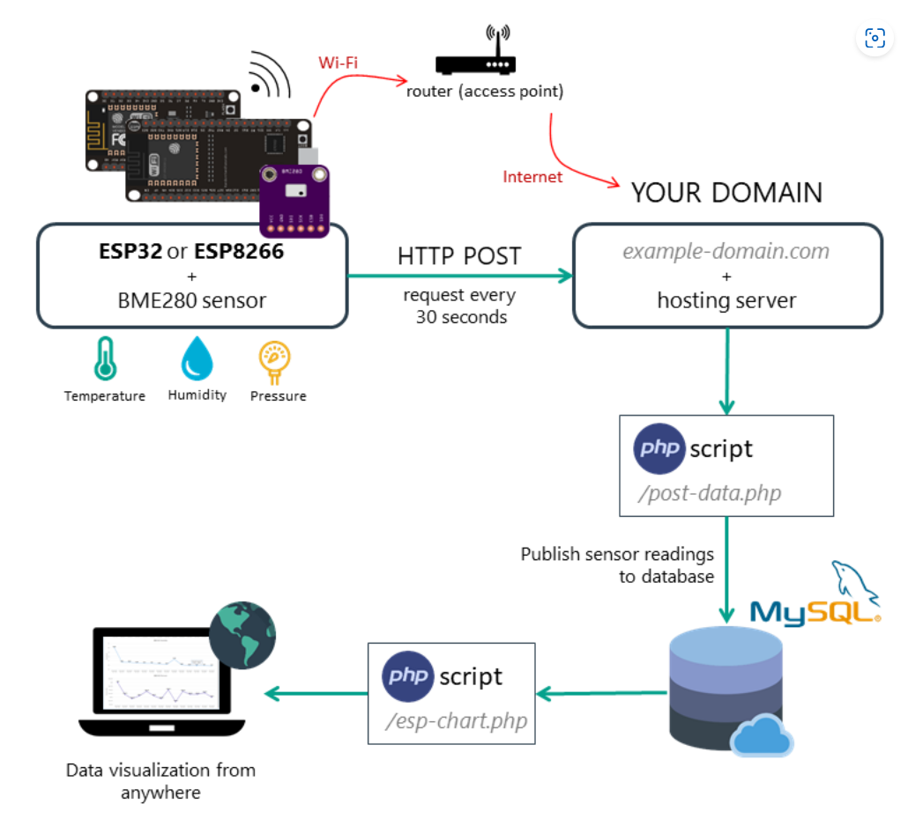

# Visualize Your Sensor Readings from Anywhere in the World (ESP32/ESP8266 + MySQL + PHP)

I followed a tutorial from this [Source](https://randomnerdtutorials.com/visualize-esp32-esp8266-sensor-readings-from-anywhere/) in order to create an webserver. The webserver is hosted by Bluehost and an ESP32 connected to Wifi posts BME280 sensor data to an SQL server. This is displayed on a chart. This README will be used to explain various parts of the code.

[ESP32 Chart](http://skd.yup.mybluehost.me/esp-chart.php)

## Network Architecture

## SQL database
Go to `MySQL DatabaseWizard` and create a new database. You can create database users as well. Multiple users are possible to give different access permisions to different users. Hence the database name and the database username is different. To set up MySQL select `phpMyAdmin` This is where we create the SQL database. We click on the SQL tab and enter the SQL query used to create the database.

    CREATE TABLE Sensor (
        id INT(6) UNSIGNED AUTO_INCREMENT PRIMARY KEY,
        value1 VARCHAR(10),
        value2 VARCHAR(10),
        value3 VARCHAR(10),
        reading_time TIMESTAMP DEFAULT CURRENT_TIMESTAMP ON UPDATE CURRENT_TIMESTAMP
    )

On the left side, we notice we can see the full database which is named Sensor, and a New tab which we can use to add data.

## PHP Scripts

Go back to advanced and search for `File Manager`. Under public_html create new files for the 2 scripts [esp-chart.php](php/esp-chart.php) and [post-data.php](php/post-data.php). Note that they both have the same api_key_value which will be used by the ESP32.  post-data.php is used to post data to the SQL server while esp-chart processes SQL data and plots in on a graph. The graph is built with the [highcharts library](https://www.highcharts.com/docs/index).

Below shows an example char viewed on web browser. Note that on mobile browser the chart is squeezed so it will show half the data. If the time interval between data points is 15mins originally on desktop, it will be shown as 30mins on mobile.

## ESP32
An [Adafruit ESP32 Huzzah v2](https://www.adafruit.com/product/5400) was used because it could fit in the breadboard better and had Lipo charging capabilities. Hence, this could be used a more portable project.

The ESP32 code is simple. The BME280 sensor is wired to the ESP32 and the sensor data is posted in the format. Note that `serverName` is the website which refers to http://skd.yup.mybluehost.me/post-data.php. 

    WiFiClient client;
    HTTPClient http;
    http.begin(client, serverName);
    http.addHeader("Content-Type", "application/x-www-form-urlencoded");
    String httpRequestData = "api_key=" + apiKeyValue + "&value1=" + String(bme.readTemperature())
                           + "&value2=" + String(bme.readHumidity()) + "&value3=" + String(bme.readPressure()/100.0F) + "";
    Serial.print("httpRequestData: ");
    Serial.println(httpRequestData);
    
    int httpResponseCode = http.POST(httpRequestData);

I added the deep sleep functionality for it to get data every **15mins**. Hence the trend of data is better seen. With a maximum of 40 data points, we can see how the data changes over 10 hours.

For the time function, I used the internal RTC memory and the NTP Client server to get the time which is printed on the Eink screen. There will be times that the post function does not work, or WiFi is not connected, and I still want to see the last reading. The NTP Client Server is initially used to get the time and is saved to RTC memory. If wifi is not connected, then the RTC memory is incremented by 15mins and that is displayed. 

Note that the RTC memory will be initialised on boot up to the assigned value. After that it uses past stored RTC values.

## Eink Screen
I added an Eink screen to display the latest data. The [GxEPD2 Library](https://github.com/ZinggJM/GxEPD2) was used with the MH-ET 2.9" Live Epaper Display ([AliExpressLink](https://www.aliexpress.com/item/4001338269518.html?spm=a2g0o.order_list.order_list_main.5.1f7f1802g598H8)).

I used this [source](https://forum.arduino.cc/t/help-with-waveshare-epaper-display-with-adafruit-huzzah32-esp32-feather-board/574300/8) to set up the Epaper display. Its alot simpler than the example given in the GxEPD2 Library. The SPI wiring is also different from standard ESP32s and I thus had to remap the values and initialise it differently. However, this method is probably the neatest, even for future applications rather than the example given.

    #include <SPI.h>
    #include <GxEPD2_BW.h>

    #define EPD_BUSY  32  // to EPD BUSY
    #define EPD_CS    15  // to EPD CS
    #define EPD_RST   27 // to EPD RST
    #define EPD_DC    33 // to EPD DC
    #define EPD_SCK   5 // to EPD CLK
    #define EPD_MISO  21 // Master-In Slave-Out not used, as no data from display
    #define EPD_MOSI  19 // to EPD DIN

    //specific to eink screen
    GxEPD2_BW<GxEPD2_290_T94, GxEPD2_290_T94::HEIGHT> display(GxEPD2_290_T94(EPD_CS, EPD_DC, EPD_RST, EPD_BUSY));

    void setup(){
        SPI.begin(EPD_SCK, EPD_MISO, EPD_MOSI, EPD_CS);
        display.init(115200);
    }

Note that for this library, `display.init` initialises the `Serial.begin` function, and thus there is no need to call it again. Calling `Serial.begin(115200)` before the init will lead to the ESP32 hanging. This was discovered from this [source](https://forum.arduino.cc/t/waveshare-e-paper-displays-with-spi/467865/2552).